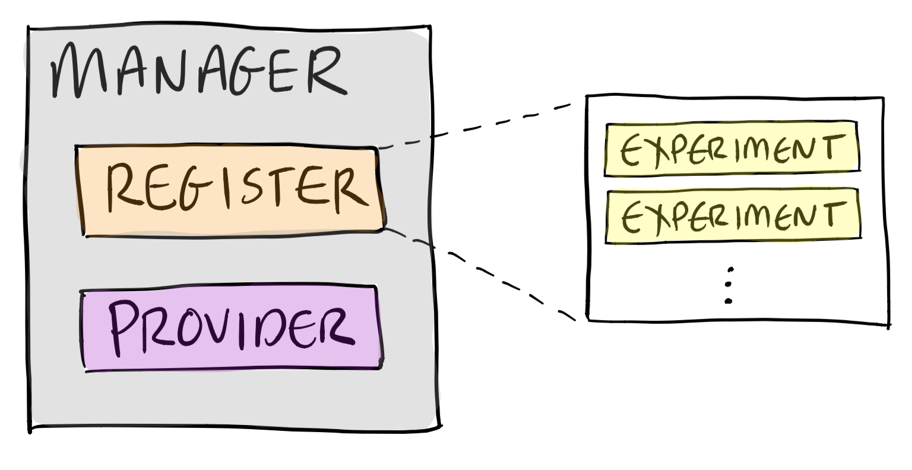

# Canvass Architecture
Canvass is made up of a few components:

## 1. Manager
- Manages all components of Canvass
- Hooks up events and listeners
- Provides interface for applications to use Canvass

## 2. Experiments
- Stores state related to an experiment
- Emits events when something changes in the experiment

## 3. Register
- Stores all registered experiments

## 4. Providers
- Interface to the a/b testing functions, such as:
  - Retrieving a group for the user
  - Tracking data and results
- Abstracts interface to third party platforms such as Qubit

## How They Fit Together

