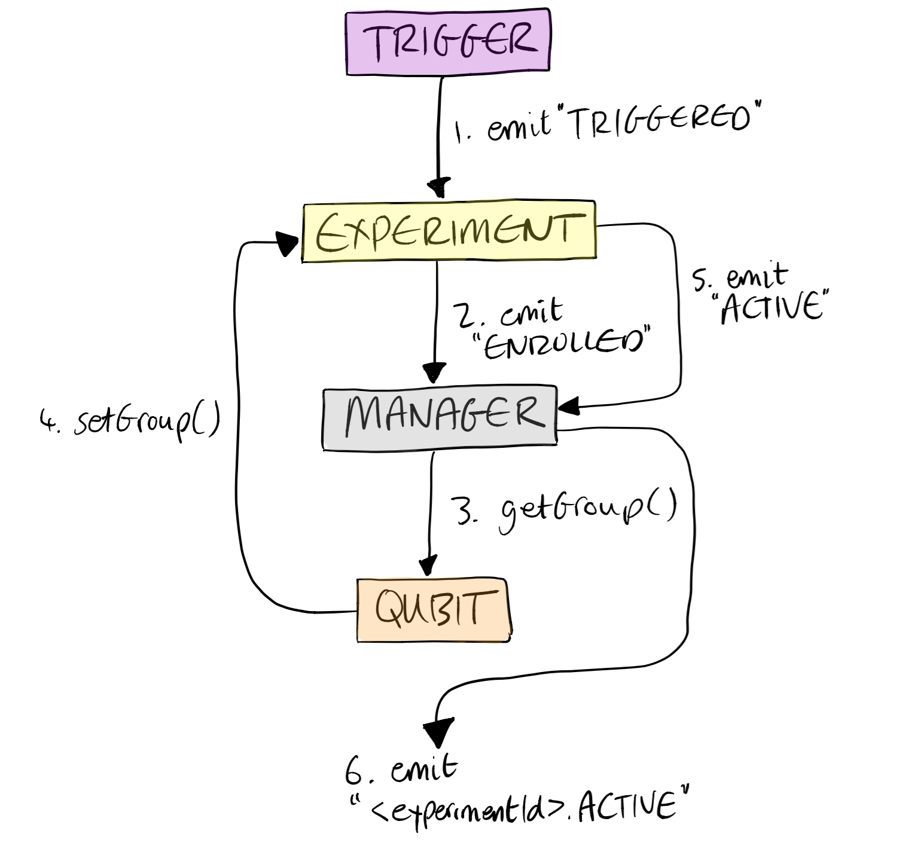

# Event Flow
Canvass is event based which means you can attach listeners to any changes that occur in the system. Events are implemented using a polyfill of *EventEmitter* which can be found in [src/Helpers/EventEmitter.js](../src/Helpers/EventEmitter.js).

## Events

<table>
  <tr>
    <th>Object</th>
    <th>Event Name</th>
    <th>Description</th>
  </tr>

  <tr>
    <td rowspan="3">Experiment</td>
    <td>WAITING</td>
    <td rowspan="3">Emitted when the experiment changes state. See "Experiment" in docs folder for more info.</td>
  </tr>
  <tr>
    <td>ENROLLED</td>
  </tr>
  <tr>
    <td>ACTIVE</td>
  </tr>

  <tr>
    <td>Manager</td>
    <td>&lt;experimentId&gt;.ACTIVE</td>
    <td>Emitted when an experiment with that ID becomes active.</td>
  </tr>

  <tr>
    <td>Trigger</td>
    <td>TRIGGERED</td>
    <td>Emitted when a trigger is satisfied.</td>
  </tr>

</table>

## Experiment Activating (Example)

1. When the trigger is satisfied, it emits TRIGGERED.
2. The experiment, which is listening to the TRIGGERED event, becomes enrolled so emits ENROLLED.
3. When an experiment becomes enrolled, the manager which is listening reacts by asking the Provider for a group for the user.
4. In this example, Qubit returns a group by setting it on the Experiment.
5. Now the experiment has a group it becomes active and emits the ACTIVE event.
6. The manager hears the experiment becoming active, so emits the experimentId.ACTIVE event for your application to react to.
