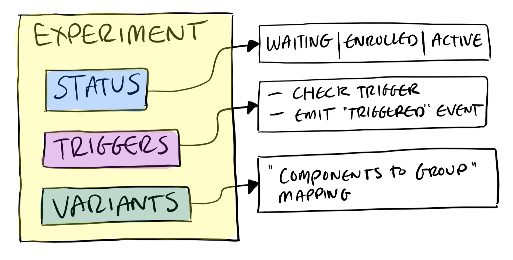

# Experiments
Experiments are the fundamental concept of Canvass. They contain all the state and logic to do with an experiment. They are defined by a few key components which will be explained in this document.

## Overview

In this diagram, you can see that an experiment is made up of three main components:
1. **Status** - The state of the experiment. See section Statuses for more info.
2. **Triggers** - Array containing all triggers that need to be satisfied before this experiment is enrolled.
3. **Variants** - Object describing the views for each group in an experiment.

## Statuses
The state of an experiment can be described with one of the three statuses: Waiting, Enrolled or Active.

<table>
  <tr>
    <th>Status</th>
    <th>Description</th>
  </tr>
  <tr>
    <td>WAITING</td>
    <td>When the initialised experiment is waiting for triggers to fire.</td>
  </tr>
  <tr>
    <td>ENROLLED</td>
    <td>When all triggers have fired and the experiment is ready to receive a group for the user to be a part of.</td>
  </tr>
  <tr>
    <td>ACTIVE</td>
    <td>When a group has been set and the correct variant can now be displayed to the user.</td>
  </tr>
</table>

The experiment emits an event when it's status changes. You can find more information about events in the [Event Flow docs](EventFlow.md).

Canvass remembers if an experiment was enrolled previously by storing it in a cookie called "canvassTriggeredExperiments". If this is the case, the experiment's status is automatically set to enrolled. This ensures that a user stays in an experiment after it triggering.

## Triggers
Triggers define the logic that describes when a user should be placed into a group in the experiment. For example, when the user visits some specific page, or performs some specific action in your application.

An experiment can have multiple triggers defined. These are passed into the experiment in an array. When one of the triggers fires, the experiment checks if all of it's triggers are satisfied. The experiment will not become enrolled unless all triggers are simultaneously true.

You should extend the BaseTrigger found in src/Toolkit and implement the abstract methods found there. For an example implementation, take a look in [examples/](../examples/).

## Variants
The variants object implements a map between the groups of the experiment and the view that the user should see.

The keys of the map should match the group ids returned by the Provider. The values are used to describe the view for that group, and can be any type that you like such as a simple string or even a view component. This value is what Canvass returns to you in your application for you to use to display the correct display to the user. When an experiment becomes active in your application, you call `experiment.getVariant()` to get the view object from the map. For an example implementation, take a look in [examples/](../examples/).
